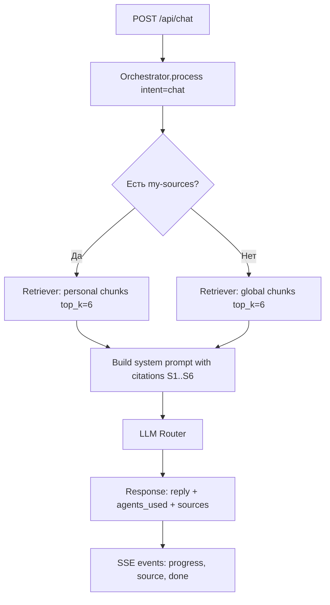

# Architecture

## ChatRagPipeline (v4.2)

### Steps
1. Определение источника retrieval: персональная база пользователя (`username`) или fallback на глобальные документы.
2. Формирование контекста с цитируемыми фрагментами (`[S1]`, `[S2]`...).
3. Генерация ответа через LLM Router с ограничением: опираться на контекст.
4. Возврат `sources: [{title, page, score}]` и `agents_used: ["retriever", "responder"]`.
